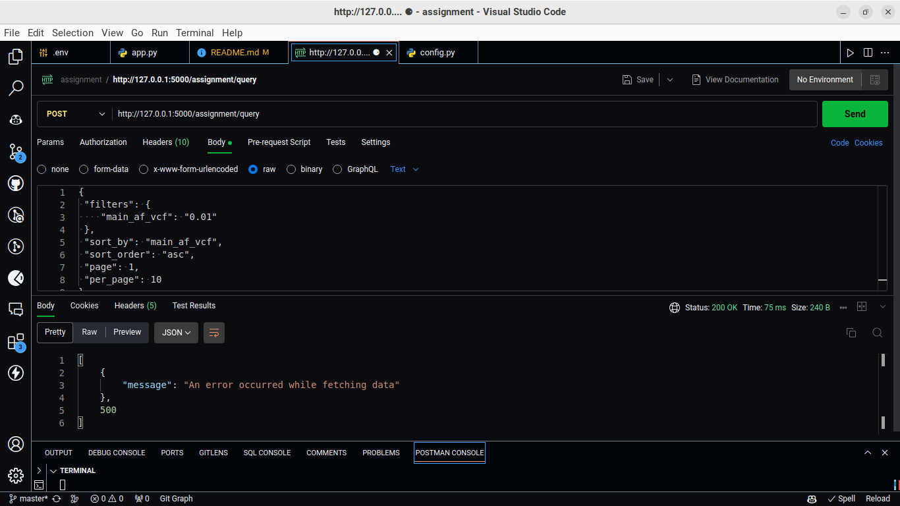

# Flask PostgreSQL Data Fetcher

## Overview

Flask PostgreSQL Data Fetcher is a web application designed to connect to a PostgreSQL database and fetch data based on user-defined filters, sorting, and pagination options. This project showcases the use of Flask for creating a simple API endpoint and psycopg2 for database interaction, without relying on an ORM layer. It demonstrates the implementation of secure credential access through environment variables and provides a practical example of handling database queries in a Python web application.

## Features

- **Database Connection**: Securely connects to a PostgreSQL database using environment variables.
- **Data Fetching**: Fetches data from a specified table based on user-defined filters, sorting, and pagination.
- **API Endpoint**: Provides a `/assignment/query` endpoint that accepts POST requests with JSON payloads for querying data.

## Tech Stack

- 
- 
- 

## Getting Started

### Prerequisites

- 
- 

### Installation

1. Clone the repository: `git clone <repository_url>`
2. Navigate to the project directory: `cd <project_directory>`
3. Install the required Python packages: `pip install -r requirements.txt`
4. Set up your environment variables in a `.env` file based on the `.env.example` provided.
5. Run the Flask application: `python app.py`

## Usage

To use the application, send a POST request to the `/assignment/query` endpoint with a JSON payload containing your query parameters. For example:

{
 "filters": {
    "main_af_vcf": "0.01"
 },
 "sort_by": "main_af_vcf",
 "sort_order": "asc",
 "page": 1,
 "per_page": 10
}

